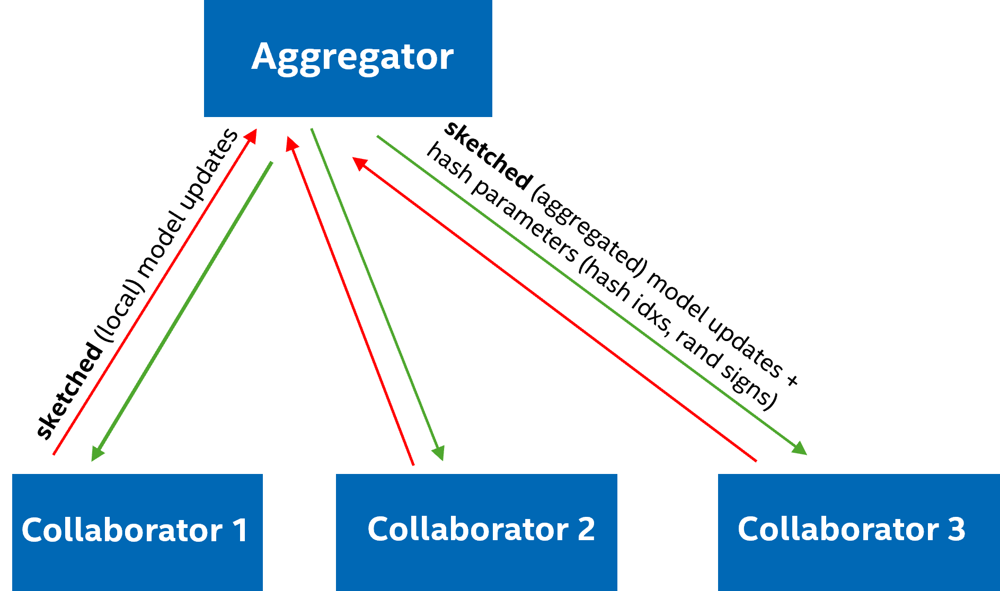

# SketchFL: Federated Learning via Matrix Sketching

Welcome to **SketchFL**, a research contribution to the OpenFL community. This project explores **integrating sketch-based compression into federated learning workflows**, using OpenFL's experimental Workflow API to accelerate both training and inference while reducing communication overhead. Additionally, the framework adds a basic level of privacy by obfuscating the original (high-dimensional) model updates through sketching.

> **Note:** This document describes the SketchFL methodology and supplemental code. It is intended to showcase sketch-based FL research rather than serve as a standalone software package. Feel free to adapt the concepts and code snippets in your own experiments.

## Abstract

SketchFL is a framework that applies CountSketch-based compression within federated learning using OpenFL. By sketching model weights and activations in both forward and backward passes, SketchFL reduces communication bandwidth and computation time. It handles compression ratio `q >= 1.0` and supports gradient reconstruction via inverse sketching. Our evaluation on an MNIST classification task with a simple MLP architecture demonstrates that at q = 5, SketchFL maintains over 95% test accuracy while offering substantial speedups, with just 3 rounds of FL training.

## Sketching Primer

Before diving into the code, here is a high‐level (simplified) overview of CountSketch without heavy math:

1. **Goal:** Reduce a long vector of numbers (length n) to a much shorter “sketch” (length m) so it’s faster to send over the network.  

2. **How it works:**  
   - **Bucket assignment:** Each entry is assigned to one of m buckets via a hash.  
   - **Random sign flip:** Multiply each entry by +1 or –1 at random.  
   - **Bucket summation:** Sum all signed values per bucket to form the sketch of length m.  

3. **Key properties:**  
   - **Unbiased:** On average, each sketch bucket equals the sum of its original entries.  
   - **Mergeable:** You can add two sketches to get the sketch of the combined data.  
   - **Invertible (approx.):** You can approximately recover the original vector from its sketch.  

4. **Other benefits:**  
   - **Low memory footprint:** Stores only m numbers instead of n.  
   - **Fast computation:** Hashing and summation are very cheap operations.  
   - **Privacy boost:** Random signs and hashing obscure individual values.  

5. **In SketchFL:**  
   - We sketch both model weights and layer activations during training. 
   - Server and clients exchange only the sketches, cutting bandwidth.  
   - An inverse‐sketch step recovers approximate gradients for full‐size weight updates.  

For more details about CountSketch and other sketching techniques used in numerical linear algebra, please refer to <a href="https://arxiv.org/abs/1411.4357" target="_blank">[Woodruff, D.P., 2014]</a>.


## Overview



SketchFL shows how randomized numerical linear algebra techniques (CountSketch) integrate into federated learning experiments via OpenFL’s Workflow API. 

### Aggregator
1. Calculates sketched (aggregated) weights using `FedAvg` and broadcasts them along with the hash parameters.  
2. At the beginning of each round, generates fresh hash parameters.  
3. Never sees the full weights from the collaborators.

### Collaborator
1. Uses the hash parameters shared by the aggregator to compress the private input data.  
2. Calculates sketched weights through local training using compressed weight gradients and shares with the server.  
3. Never sees the full aggregated weights from the aggregator.

<!-- Included are:

- **Code Snippets:** Python modules for CountSketch utilities and a `SketchLinear` PyTorch layer.
- **Notebook Examples:** Jupyter notebooks illustrating sketch-based federated learning on MNIST with an MLP.
- **Configuration Guides:** Instructions for integrating SketchFL into an OpenFL workflow. -->

> **Note:** Current example focus on an MLP architecture on the MNIST dataset, demonstrating feasibility of sketch-based compression in federated learning.

## Running the Experiment

Run the notebook `Workflow_Interface_MLP_DoubleBlind.ipynb`.

<!-- ## Results

[Summarize the key findings of the research. You may want to include any relevant charts, graphs, or tables that illustrate the results. You may also provide links to additional resources or publications related to the project.] -->

## Citation

The core sketching methodology implemented in SketchFL is based on the following publication:
```latex
@inproceedings{zhang2021matrix, 
title={Matrix sketching for secure collaborative machine learning}, 
author={Zhang, Mengjiao and Wang, Shusen}, 
booktitle={International Conference on Machine Learning}, 
pages={12589--12599}, 
year={2021}, 
organization={PMLR}}